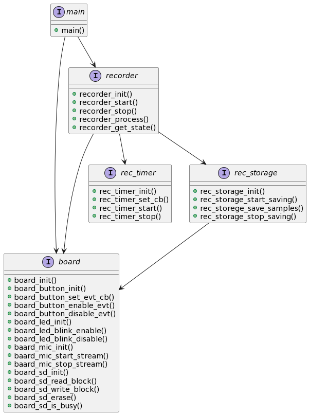

# Sound recorder firmware
Recorder firmware for Discovery F4 development kit. This firmware get samples from microphone and save them into SD Card memory. 
Recording parameters:
- Sample rate: 16 kHz 
- Resolution: 16 bit
- Channels: stereo sound

The recording process starts when the blue button is pressed briefly. A blinking red LED indicates the recording process. The recording process stops when the blue button is pressed for 2 seconds.
## Repo structure
    .
    ├── docs                            # Project support documentation
    ├── projects                        # Project build solutions
    │   ├── application_cube_ide        # Main application solution STM32CubeIDE
    │   └── test                        # Additional test solutions
    │       ├── cube_init               # Peripheral init example solution STM32CubeIDE
    │       └── rec_storage             # rec_storage module test solution STM32CubeIDE
    └── sources                         # Project source files
        ├── application                 # Applications source files
        ├── board                       # Boars support source files
        ├── components                  # Application support components source files
        ├── sdk                         # Vendor SDK files
        └── third_party                 # Third party sources

## Firmware architecture
NOTE: rec_timer module not implemented yet!

## SD Card connection
```
CMD     --> PD2
CLK     --> PC12
DAT0    --> PC8
DAT1    --> PC9
DAT2    --> PC10
DAT3    --> PC11
```